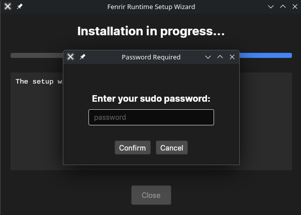

---

## Fenrir Runtime Setup Wizard (Linux)

This is the setup wizard for the **Fenrir Runtime**, an application designed to simplify the installation of the Fenrir Runtime environment on Linux distributions.

### Purpose

This wizard's primary function is to **automate the installation process** for Fenrir. It handles several key steps that typically require manual terminal input:

1.  **SUDO Password Handling:** It securely collects the user's `sudo` password using a graphic interface (Avalonia UI).
2.  **Repository Cloning:** It automatically clones the Fenrir source code from the official Git repository to the user's home directory.
3.  **Build Process:** It executes the necessary compilation commands, including `npm run build` and `make`, using elevated (sudo) privileges to correctly install the runtime environment.
4.  **Status Logging:** It provides real-time logs and status updates on the installation progress to the user.

**The goal is to provide a fast, easy, and reliable way to install Fenrir without relying on command-line expertise.**

## Download the Application
Due to Github's 25mb limit, I have to provide you with the download link via Mediafire.
[Install Fenrir Runtime Installer](https://www.mediafire.com/file/elsyvsm3unhrfnj/Fenrir.zip/file)

## Images

